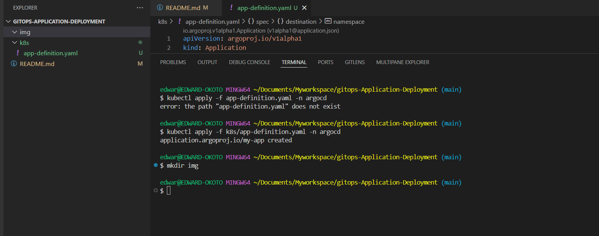

# gitops-Application-Deployment
Application Deployment and Management in ArgoCD

#### Lesson 1 : Defining and Deploying an application using ArgoCD.

**Kubernetes manifest file** to define and deploy an application using Argo CD in a GitOps workflow.

---

### **📂 `application.yaml`**
```yaml
apiVersion: argoproj.io/v1alpha1
kind: Application
metadata:
  name: vision-app
  namespace: argocd
spec:
  project: default
  source:
    repoURL: 'https://github.com/Edward-okoto/gitops-Application-Deployment.git'
    path: k8s
    targetRevision: HEAD
  destination:
    server: 'https://kubernetes.default.svc'
    namespace: vision-app

```

---

### **Steps to Deploy**
1️⃣ **Apply the manifest to Argo CD**:
```bash
kubectl apply -f k8s/app-definition.yaml -n argocd
```


2️⃣ **Sync the application manually** (if needed):
```bash
argocd app sync vision-app
```
3️⃣ **Verify Deployment**:
```bash
kubectl get applications -n argocd
```
4️⃣ **Check the Argo CD UI** (`http://localhost:8080`) to see the application status.

---

### **🔍 Explanation**
✅ **Defines `Application` resource for Argo CD**  
✅ **Sets Git repository as the source** (`repoURL`)  
✅ **Uses `overlays/prod` for configuration**  
✅ **Deploys to Kubernetes `prod` namespace**  
✅ **Enables automated syncing and self-healing**  


