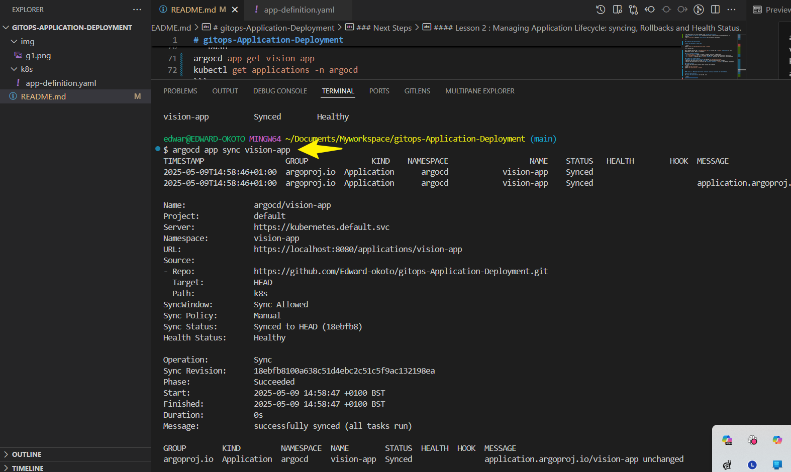
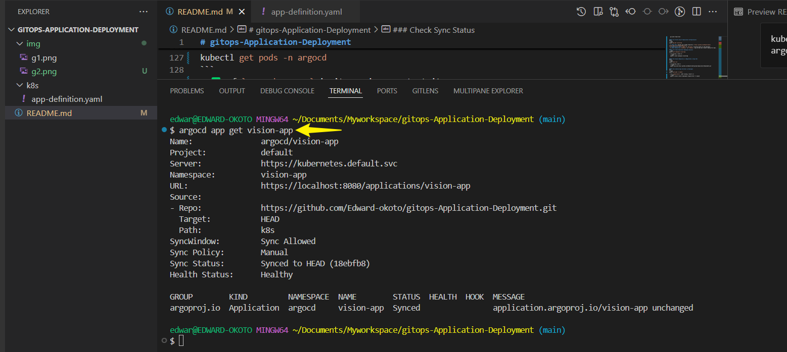
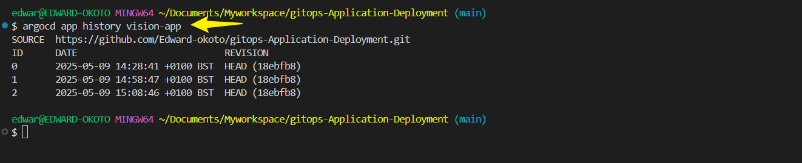
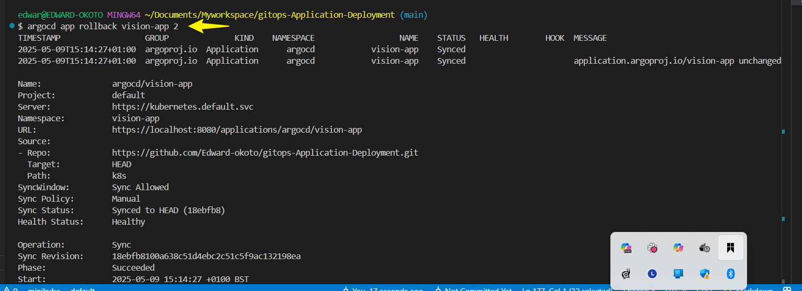
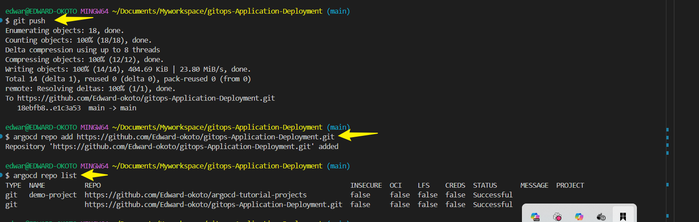
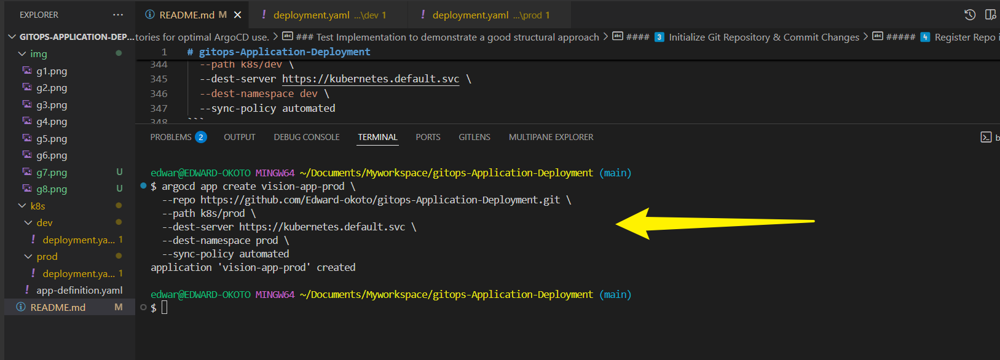

# gitops-Application-Deployment
Application Deployment and Management in ArgoCD

## Lesson 1 : Defining and Deploying an application using ArgoCD.

**Kubernetes manifest file** to define and deploy an application using Argo CD in a GitOps workflow.


**Define an application in argoCD**

#### **`app-definition.yaml`**

```yaml
apiVersion: argoproj.io/v1alpha1
kind: Application
metadata:
  name: vision-app
  namespace: argocd
spec:
  project: default
  source:
    repoURL: 'https://github.com/Edward-okoto/gitops-Application-Deployment.git'
    path: k8s
    targetRevision: HEAD
  destination:
    server: 'https://kubernetes.default.svc'
    namespace: vision-app
```
This **Argo CD application definition (`app-definition.yaml`)** sets up GitOps deployment for `vision-app`.

#### **Summary**
- **Defines an Argo CD application** named `vision-app` in the `argocd` namespace.
- **Sources Kubernetes manifests** from the Git repository at:
   `'https://github.com/Edward-okoto/gitops-Application-Deployment.git'`
- **Deployment path** is set to `k8s/`, pulling configuration files for the app.
- **Target revision** is `HEAD`, meaning it always syncs with the latest Git commit.
- **Deploys to the Kubernetes cluster** (`https://kubernetes.default.svc`) under the `vision-app` namespace.
- **Belongs to the default Argo CD project**, managing the application's lifecycle.

#### ** What This Means**
✅ The application is fully managed using **GitOps principles**.  
✅ **Any updates in the Git repo** automatically sync to the cluster (if automated sync is enabled).  
✅ The `vision-app` namespace **must exist** for successful deployment.  

---

### **Deploy The Application**

**Apply the manifest to Argo CD**:

```bash
kubectl apply -f k8s/app-definition.yaml -n argocd
```


This command applies the **`app-definition.yaml`** file to the **`argocd` namespace** in your Kubernetes cluster. Here's a breakdown:

### **🔍 Command Breakdown**
- **`kubectl apply`** → Used to create or update resources in Kubernetes.
- **`-f app-definition.yaml`** → Specifies the YAML file containing the resource definition.
- **`-n argocd`** → Targets the **`argocd` namespace**, ensuring the resource is deployed there.

### **What This Command Does**
✅ **Deploys the Argo CD application** as defined in `app-definition.yaml`.  
✅ Registers the application inside **Argo CD**, pulling configurations from Git.  
✅ Ensures the application is placed in the **correct namespace (`argocd`)** for GitOps management.  

### **Next Steps**
To verify the application status after running this command:
```bash
argocd app get vision-app
kubectl get applications -n argocd
```


## Lesson 2 : Managing Application Lifecycle: syncing, Rollbacks and Health Status.

### **Syncing Application**

Before syncing your application in **Argo CD**, make sure you’ve checked these key requirements to avoid errors:

#### **✅ Pre-Sync Checklist**
##### **1️⃣ Ensure Git Repository is Updated**
Run:
```bash
git status
```
- ✅ Confirm **all necessary manifests** (`deployment.yaml`, `service.yaml`, etc.) exist.
- ✅ Make sure changes are **committed & pushed** to Git:
  ```bash
  git add .
  git commit -m "Updated Kubernetes manifests"
  git push origin main
  ```

##### **2️⃣ Verify Argo CD Application Configuration**
Check:
```bash
argocd app get vision-app
```
- ✅ **Repo URL** matches your GitHub repository (`https://github.com/Edward-okoto/gitops-Application-Deployment.git`).
- ✅ **Application path** (`k8s/` or `k8s/prod`) correctly points to the manifests.
- ✅ **Sync Status** is `OutOfSync` (if `Unknown`, Argo CD may have trouble reading the repo).

##### **3️⃣ Check Kubernetes Namespace Exists**
```bash
kubectl get namespace vision-app
```
- ✅ If missing, create it:
  ```bash
  kubectl create namespace vision-app
  ```

##### **4️⃣ Ensure Repository is Registered in Argo CD**
Check:
```bash
argocd repo list
```
- ✅ If missing, add it:
  ```bash
  argocd repo add https://github.com/Edward-okoto/gitops-Application-Deployment.git
  ```

##### **5️⃣ Confirm Argo CD Server is Running**
Run:
```bash
kubectl get pods -n argocd
```
- ✅ If `argocd-server` isn’t running, restart it:
  ```bash
  kubectl rollout restart deployment argocd-server -n argocd
  ```

To **sync the application** in Argo CD, run:

```bash
argocd app sync vision-app
```


##### **What Happens During Sync?**
✅ Pulls the latest **Git version** of `vision-app`  
✅ Compares Git state with **Kubernetes cluster**  
✅ Applies any **changes** to Kubernetes  
✅ Ensures resources are correctly deployed  

#### **Check Sync Status**
After syncing, verify:
```bash
argocd app get vision-app
```


### **Performing Rollbacks**

To **rollback** your application in Argo CD, follow these steps:

##### ** 1️⃣ View Previous Application Versions**
Check the **history** of deployed versions:
```bash
argocd app history vision-app
```
You'll see a list of previous revisions with their **commit SHAs**.


---

##### **🔄 2️⃣ Roll Back to a Previous Version**
Choose the correct version from the history and rollback:
```bash
argocd app rollback vision-app <REVISION_ID>
```
Replace `<REVISION_ID>` with the desired **revision number** from the history.

Example:
```bash
argocd app rollback vision-app 2
```


This reverts your application to **revision 2**.

---

##### **3️⃣ Verify Rollback & Status**
Once rollback is complete, check:
```bash
argocd app get vision-app
kubectl get pods -n vision-app
kubectl get deployments -n vision-app
```

If something goes wrong, you can manually sync:
```bash
argocd app sync vision-app
```

## Lesson 3 : Structuring Git repositories for optimal ArgoCD use.

Structuring your Git repository properly ensures **optimal use of Argo CD** for GitOps deployments. Here’s a **best-practice guide**:

---

#### **Recommended Git Repository Structure**

```plaintext
gitops-repo/
│── environments/             # Organizes applications by environments (dev, staging, prod)
│   ├── dev/
│   │   ├── k8s/              # Manifests for Dev environment
│   │   ├── app-definition.yaml
│   ├── staging/
│   │   ├── k8s/              # Manifests for Staging
│   │   ├── app-definition.yaml
│   ├── prod/
│       ├── k8s/              # Manifests for Production
│       ├── app-definition.yaml
│
├── apps/                     # Application manifests (ArgoCD Applications)
│   ├── vision-app.yaml
│   ├── demo-app.yaml
│
├── charts/                   # Helm charts for packaging Kubernetes apps
│   ├── vision-app/
│   │   ├── Chart.yaml
│   │   ├── values.yaml
│   │   ├── templates/
│
├── infrastructure/           # Cluster-wide resources (RBAC, network policies)
│   ├── rbac.yaml
│   ├── ingress.yaml
│
├── README.md                 # Documentation
```

---

#### **Key Best Practices for Argo CD**
##### **1️⃣ Separate Environment-Specific Configurations**
- Store different environments (`dev`, `staging`, `prod`) **in separate folders** to maintain clean deployment pipelines.

##### **2️⃣ Use Helm for Application Packaging**
- Use **Helm charts** to simplify deployments and manage **templated manifests** (`values.yaml` for customization).

##### **3️⃣ Define Applications in Argo CD Separately**
- Store **Argo CD application definitions** inside `apps/`, making them **easy to reference and manage**.

##### **4️⃣ Implement Infrastructure-As-Code Principles**
- Store cluster-wide configurations (`RBAC`, `Ingress`, `Network Policies`) separately **in the `infrastructure/` folder**.

##### **5️⃣ Automate Sync Policies**
- Use **automated sync in Argo CD**, ensuring apps always match **the desired Git state**.

### Test Implementation to demonstrate a good structural approach

##### **1️⃣ Create the Directory Structure**
Run:
```bash
mkdir -p k8s/dev k8s/prod src
touch k8s/dev/deployment.yaml k8s/prod/deployment.yaml README.md
```
This will create the **correct folder hierarchy**.

---

##### ** 2️⃣ Define Kubernetes Deployment Manifests**
Populate the `deployment.yaml` files for `dev` and `prod`.

✅ **`k8s/dev/deployment.yaml`**
```yaml
apiVersion: apps/v1
kind: Deployment
metadata:
  name: vision-app-dev
  namespace: dev
spec:
  replicas: 1
  selector:
    matchLabels:
      app: vision-app
  template:
    metadata:
      labels:
        app: vision-app
    spec:
      containers:
        - name: vision-app
          image: your-dev-image:latest
          ports:
            - containerPort: 8080
```

✅ **`k8s/prod/deployment.yaml`**
```yaml
apiVersion: apps/v1
kind: Deployment
metadata:
  name: vision-app-prod
  namespace: prod
spec:
  replicas: 2
  selector:
    matchLabels:
      app: vision-app
  template:
    metadata:
      labels:
        app: vision-app
    spec:
      containers:
        - name: vision-app
          image: your-prod-image:latest
          ports:
            - containerPort: 8080
```

---

#### **3️⃣ Initialize Git Repository & Commit Changes**
Run:
```bash
git init
git add .
git commit -m "Initial commit - GitOps structure"
git remote add origin https://github.com/Edward-okoto/gitops-Application-Deployment.git
git push origin main
```

Now your repository is **ready for Argo CD**.

---

##### **4️⃣ Register Repo in Argo CD & Create Application**
Add the repository to Argo CD:
```bash
argocd repo add https://github.com/Edward-okoto/gitops-Application-Deployment.git
```


Create the Argo CD application:
```bash
argocd app create vision-app-dev \
  --repo https://github.com/Edward-okoto/gitops-Application-Deployment.git \
  --path k8s/dev \
  --dest-server https://kubernetes.default.svc \
  --dest-namespace dev \
  --sync-policy automated
```


Repeat for `prod`:
```bash
argocd app create vision-app-prod \
  --repo https://github.com/Edward-okoto/gitops-Application-Deployment.git \
  --path k8s/prod \
  --dest-server https://kubernetes.default.svc \
  --dest-namespace prod \
  --sync-policy automated
```


#### **Next Steps for GitOps Deployment in Argo CD**

##### **1️⃣ Push the Repository to GitHub**
Since Argo CD pulls changes from Git, ensure your repository is updated:
```bash
git add .
git commit -m "Finalizing GitOps setup for Argo CD"
git push origin main
```

---

##### **2️⃣ Register Your GitHub Repository in Argo CD**
Verify your repository is added:
```bash
argocd repo list
```
If missing, add it:
```bash
argocd repo add https://github.com/Edward-okoto/gitops-Application-Deployment.git
```

---

##### **3️⃣ Create Argo CD Applications for Dev & Prod**
Run:
```bash
argocd app create vision-app-dev \
  --repo https://github.com/Edward-okoto/gitops-Application-Deployment.git \
  --path k8s/dev \
  --dest-server https://kubernetes.default.svc \
  --dest-namespace dev \
  --sync-policy automated
```
And for `prod`:
```bash
argocd app create vision-app-prod \
  --repo https://github.com/Edward-okoto/gitops-Application-Deployment.git \
  --path k8s/prod \
  --dest-server https://kubernetes.default.svc \
  --dest-namespace prod \
  --sync-policy automated
```

---

##### **4️⃣ Sync Applications**
Trigger sync:
```bash
argocd app sync vision-app-dev
argocd app sync vision-app-prod
```

---

##### **5️⃣ Verify Deployment**
Check the status of pods and deployments:
```bash
kubectl get pods -n dev
kubectl get pods -n prod
kubectl get deployments -n dev
kubectl get deployments -n prod
```

---

##### **Wrapping Up**
✅ Push repository changes to GitHub  
✅ Register Git repo in Argo CD  
✅ Create **dev** and **prod** applications  
✅ Sync both applications  
✅ Verify Kubernetes deployment  


